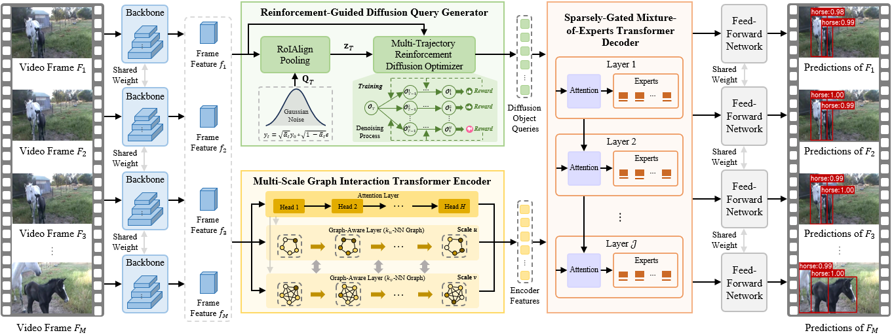
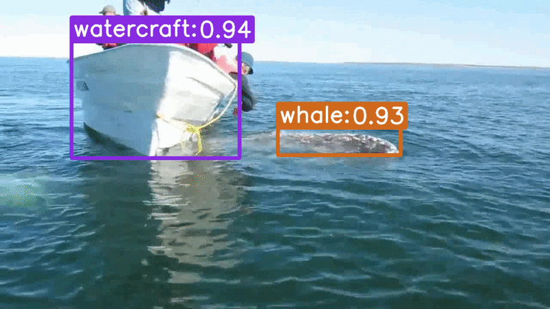
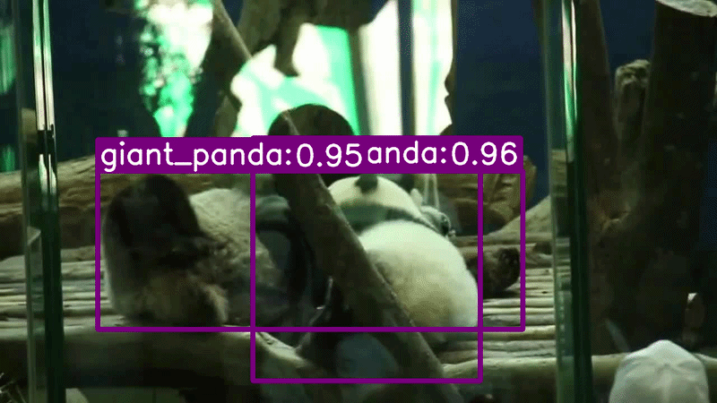

This repository is an official implementation of M2TDiff.

**M2TDiff is an Extended Framework Built upon Our [AAAI 2025](https://ojs.aaai.org/index.php/AAAI/article/view/32703) and [AAAI 2026](https://ojs.aaai.org/index.php/AAAI/article/view/37798) Works**

# M2TDiff: Multi-Scale MoE-Enhanced Transformer Diffusion Network for Video Object Detection

<div align="center">  </div>

## Abstract

Video object detection is a pivotal yet challenging
task in computer vision. In recent years, DETR-based methods
have gained prominence in this domain owing to their powerful
global modeling capability. However, these methods are usually
confronted with three crucial limitations: frame-agnostic object query initialization, scale-agnostic attention mechanism and
heterogeneity-agnostic feature transformation, which hinder their
capability to capture dynamic appearance variations and model
cross-frame temporal dependencies. To alleviate these limitations,
we propose a novel Multi-scale MoE-enhanced Transformer
Diffusion (M2TDiff) network for video object detection, including
three core technical improvements over existing methods. First,
we introduce a reinforcement-guided diffusion query generator,
which models the object query distribution through an iterative
diffusion process conditioned on the input frames and optimized
using a multi-trajectory reinforcement learning strategy, generating adaptive and content-aware object queries. Second, we design
a multi-scale graph interaction transformer encoder, which combines multi-head attention mechanisms with multi-scale dynamic
graph convolutions to learn scale-aware feature representations
while jointly modeling local and global contextual dependencies.
Third, we develop a sparsely-gated mixture-of-experts transformer decoder, which dynamically routes heterogeneous object
queries to specialized experts through sparse gating, enabling
query-specific representation learning. Furthermore, we present
two variants of M2TDiff, termed M2TDiff++ and M2TDiff-Fast,
which further improve detection accuracy by exploring more
diverse spatial-temporal cues and accelerate inference speed via
a differentiated keyframe/non-keyframe processing strategy. We
conduct experiments on the ImageNet VID and VisDrone-VID
datasets and the results show that M2TDiff achieves state-of-theart performance with a favorable accuracy-efficiency trade-off,
while its two variants further extend this frontier toward higher
accuracy and faster inference, respectively. Particularly, on the
ImageNet VID dataset, M2TDiff achieves 89.2% mAP at 45.2
FPS on a single 5090 GPU, M2TDiff++ reaches 94.1% mAP, and
M2TDiff-Fast obtains 88.5% mAP at 53.8 FPS.

## Main Results

### Comparison with Different Backbones

| Method | Backbone | Base Detector | mAP (%) | Runtime (ms) |
| :-----: | :------: | :-----------: | :-----: | :----------: |
| M2TDiff | ResNet-101 | Deformable DETR | **89.2** | 22.1 |
| M2TDiff | Swin-Base | Deformable DETR | **93.0** | 39.6 |

### Ablation Study

| Method | mAP (%) | mAP★ (%) |
| :-----: | :-----: | :------: |
| Baseline | 78.5 | 82.4 |
| + RDQG | 81.7 | 85.9 |
| + MGTE | 83.1 | 87.6 |
| + SMTD | 81.3 | 84.9 |
| **M2TDiff** | **89.2** | **93.0** |

> **mAP★** denotes the mAP (%) obtained with the Swin-Base backbone.

## Updates

* (2026/08) M2TDiff source code released.
* (2026/09) M2TDiff source code  updated.
## Installation

The codebase is built on top of [Deformable DETR](https://github.com/fundamentalvision/Deformable-DETR).

### Requirements

* Linux, CUDA>=9.2, GCC>=5.4

* Python>=3.7

  We recommend using Anaconda to create a conda environment


* PyTorch>=1.5.1, torchvision>=0.6.1 (following instructions [here](https://pytorch.org/))


* Other requirements

  ```bash
  pip install -r requirements.txt
  ```


## Usage

### Dataset Preparation

M2TDiff is evaluated on the widely used video object detection benchmark, **ImageNet VID**. To further evaluate its generalization capability, we additionally conduct experiments on **VisDrone-VID**. Before training and evaluation, the annotations of ImageNet VID and VisDrone-VID need to be converted into the unified JSON format used by M2TDiff. ImageNet VID provides annotations in XML format, while VisDrone-VID provides annotations in TXT format. We provide ```tools/convert_to_vid_json.py ```to perform the conversion.

#### ImageNet VID

Download the ILSVRC2015 DET and ILSVRC2015 VID datasets from
[the official website](https://image-net.org/challenges/LSVRC/2015/2015-downloads).
The expected directory structure is:

```text
code_root/
└── datasets/
    └── imagenet_vid/
        ├── Data/
        │   └── VID/
        │       ├── train/
        │       └── val/
        │
        └── annotations/
            └── VID/
                ├── train/
                └── val/
```

#### VisDrone-VID

Download the VisDrone-VID dataset from the
[official VisDrone website](https://github.com/VisDrone/VisDrone-Dataset)
and organize the dataset according to the following structure:

```text
code_root/
└── datasets/
    └── visdrone_vid/
        ├── sequences/
        │   ├── train/
        │   └── val/
        │
        └── annotations/
            ├── train/
            └── val/
```

After downloading and processing the datasets, make sure that the directory
structure matches the layouts shown above. We recommend using symbolic links
to place the datasets under the `datasets/` directory.


### Pretraining the Single-Frame Baseline

1. Download the COCO-pretrained weights from
   [Deformable DETR](https://github.com/fundamentalvision/Deformable-DETR) and
   put the checkpoint into:

```text
./exps/our_models/COCO_pretrained_model/
```

2. Train the single-frame baseline, which is used as the resume checkpoint
   of M2TDiff:

```bash
GPUS_PER_NODE=4 ./tools/run_dist_launch.sh $1 r101 $2 configs/r101_train_single.sh
```

### Training M2TDiff

Using the single-frame baseline weights 
as the resume model:

```bash
#  4 GPUs
GPUS_PER_NODE=4 ./tools/run_dist_launch.sh 4 configs/r101_train_m2tdiff.sh
```

All RDQG, MGTE, and SMTD hyperparameters are exposed as `main.py` flags;
see `configs/r101_train_m2tdiff.sh` for the recommended values.

### Evaluation

Evaluate the full M2TDiff framework using the released checkpoint:

```bash
./tools/eval_m2tdiff.sh exps/m2tdiff/r101_m2tdiff checkpoint.pth
```

To evaluate an ablation variant, disable components with `0/1` environment
variables:

```bash
USE_RDQG=0 USE_MGTE=0 USE_SMTD=0 ./tools/eval_m2tdiff.sh exps/m2tdiff/r101_A0_baseline
```
## Visualization

<div align="center">
  
  
</div>


## Acknowledgement

This project is developed based on the following project. We thank the authors
for releasing their code:

* [Deformable DETR](https://github.com/fundamentalvision/Deformable-DETR)

## Citing

If you find this work useful in your research, please consider citing:

```bibtex
@inproceedings{qi2025tgbformer,
  title={TGBFormer: Transformer-graphformer blender network for video object detection},
  author={Qi, Qiang and Wang, Xiao},
  booktitle={Proceedings of the AAAI Conference on Artificial Intelligence},
  volume={39},
  number={6},
  pages={6559--6567},
  year={2025}
}
```

And the base work:

```bibtex
@inproceedings{qi2026mstdiff,
  title={MSTDiff: Multiscale-Aware Transformer Diffusion Network for Video Object Detection},
  author={Qi, Qiang and Shang, Wenqi and Wang, Xiao and Liang, Yanjie and Lin, Shuyuan},
  booktitle={Proceedings of the AAAI Conference on Artificial Intelligence},
  volume={40},
  number={10},
  pages={8475--8483},
  year={2026}
}
```
